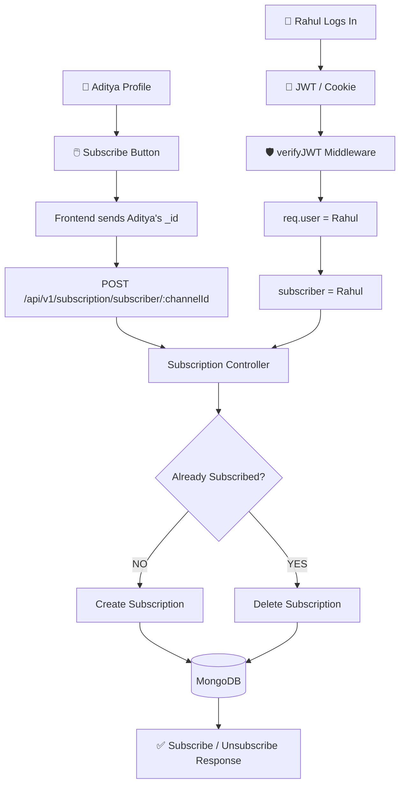

# ☕ My Chai aur Backend Learning Journey

I am currently learning **Backend Development with the MERN Stack**, and honestly, I am finding the journey really exciting and enjoyable.

I started my backend journey by following the **Sheryians Coding School backend series**. It was an amazing learning experience for me because it helped me understand the **fundamentals of backend development**. Through that series, I learned the basic concepts of how a backend works and built a strong foundation.

After understanding the fundamentals, I wanted to explore how backend applications are built using a more **structured and professional approach**. That's when I started following the **Chai aur Code Backend Series**.

I really like the way the series focuses on writing **clean, scalable, and professional backend code** instead of just creating simple projects.

So far, I have been learning and exploring concepts such as:

* Backend fundamentals and how servers work
* Node.js and Express.js
* REST APIs and HTTP methods
* Request and Response handling
* Async/Await and Promises
* Async Handler for error handling
* Custom API Error classes
* API Response structure
* Professional backend folder structure
* Controllers and Middleware
* Database connection using MongoDB and Mongoose
* Mongoose Schemas and Models
* Mongoose Middleware and Hooks
* Pre Hooks and Error Handling Hooks
* Creating Custom Methods in Mongoose
* Password hashing using Bcrypt
* Authentication using JWT
* Cookies and User Authentication
* Environment Variables
* Database Design and Relationships
* Writing clean and maintainable backend code

Currently, I am continuously learning more about **Mongoose, authentication, middleware, JWT, Bcrypt, custom methods, hooks, and professional backend architecture**.

My goal is not just to learn how to create APIs, but to understand **how real-world backend applications are structured and developed**.

I am trying to build my backend knowledge step by step:

**Fundamentals → APIs → Databases → Authentication → Professional Architecture → Real-World Projects**

I know I still have a lot to learn, but I am enjoying the process and trying to understand concepts deeply instead of just copying code.

🚀 **This is just the beginning of my Backend Development Journey.**


<!-- what i do in registration  -->

    step 1 - get user details from frontend
    step 2 - validation - not empty
    step 3 - check if user already exists: username,email
    step 4 - check for images, check for avatar
    step 5 - upload them to cloudinary , avatar
    step 6 - create user object - create entry in db
    step 7 - remove password and refresh token field from response
    step 8 - check for user creation 
    step 9 - return res

------------------
Login System . 

  1. we need to get users passsword ,email,username
  2. check the email or username is given by user or not
  3.find the user .  yes/not
  4. check passowrd is correct or not .
  5. access and refresh token check or send   (some code ,top of the code)
  6. res cookies.


----------------------------------------

How subscribe a User to another User/Channel .

# 🔔 Subscription System

A subscription system allows users to subscribe to other users/channels.

The main purpose of this feature is to maintain a relationship between:

> **Who is subscribing?** → **Whom are they subscribing to?**

For example:

```text
Rahul ───────────────→ Aditya
       subscribes to
```

Here:

* **Rahul** = Subscriber
* **Aditya** = Channel

---

# 📌 Table of Contents

* [1. Core Concept](#1-core-concept)
* [2. Why Separate Subscription Model?](#2-why-separate-subscription-model)
* [3. Data Model](#3-data-model)
* [4. Complete Architecture](#4-complete-architecture)
* [5. Subscribe Flow](#5-subscribe-flow)
* [6. What Comes From Frontend?](#6-what-comes-from-frontend)
* [7. What Comes From Authentication?](#7-what-comes-from-authentication)
* [8. Backend Processing](#8-backend-processing)
* [9. Database Record](#9-database-record)
* [10. Unsubscribe Flow](#10-unsubscribe-flow)
* [11. Toggle Subscription Logic](#11-toggle-subscription-logic)
* [12. API Route](#12-api-route)
* [13. Pseudocode](#13-pseudocode)
* [14. MongoDB ](#14-mongodb-lookup)[`$lookup`](#14-mongodb-lookup)
* [15. Important Rules](#15-important-rules)
* [16. Mental Model](#16-mental-model)

---

# 1. Core Concept

A subscription represents a **relationship between two users**.

```text
        SUBSCRIBE
Rahul ───────────────→ Aditya
  ↑                       ↑
  │                       │
Subscriber              Channel
```

The `Subscription` collection stores this relationship.

```text
Subscription
│
├── subscriber → Rahul
│
└── channel    → Aditya
```

### Golden Rule

> **subscriber = the person who clicks Subscribe**

> **channel = the person/channel being subscribed to**

---

# 2. Why Separate Subscription Model?

We already have a `User` model:

```text
User
├── _id
├── username
├── email
├── password
├── avatar
└── ...
```

But the User model shouldn't need to store every subscription relationship directly.

For example, imagine:

```text
Rahul
 ├── subscribes to Aditya
 ├── subscribes to Aman
 ├── subscribes to Vikas
 ├── subscribes to Rohit
 └── ...
```

And thousands of users can subscribe to Rahul.

Managing these relationships directly inside `User` becomes difficult.

Instead, we create a separate collection:

```text
                USERS
                  │
                  │
          ┌───────┴────────┐
          │                │
        Rahul            Aditya
          │                │
          └───────┬────────┘
                  │
                  ↓
          SUBSCRIPTION
                  │
          subscriber: Rahul
          channel: Aditya
```

This is a **relationship collection**.

---

# 3. Data Model

## User Model

```text
┌──────────────────────────┐
│          User            │
├──────────────────────────┤
│ _id                      │
│ username                 │
│ email                    │
│ password                 │
│ avatar                   │
└──────────────────────────┘
```

Example:

```text
Rahul
_id = R456

Aditya
_id = A123
```

---

## Subscription Model

```text
┌─────────────────────────────┐
│       Subscription          │
├─────────────────────────────┤
│ _id                         │
│ subscriber                  │
│ channel                     │
│ createdAt                   │
│ updatedAt                   │
└─────────────────────────────┘
```

Example:

```text
subscriber = R456
channel    = A123
```

Meaning:

```text
Rahul → Aditya
```

---

# 4. Complete Architecture

The complete flow can be visualized like this:



---

# 5. Subscribe Flow

Suppose:

```text
Logged-in user = Rahul

Target profile = Aditya
```

Rahul opens Aditya's profile:

```text
┌──────────────────────────────┐
│          ADITYA              │
│                              │
│  @aditya                     │
│  120 Subscribers             │
│                              │
│      [ SUBSCRIBE ]           │
│                              │
└──────────────────────────────┘
```

Aditya's MongoDB ID:

```text
A123
```

Rahul's MongoDB ID:

```text
R456
```

When Rahul clicks Subscribe:

```text
Frontend
   │
   │ Aditya's ID
   │ A123
   ↓
Backend
```

But Rahul's ID is **not taken from the frontend**.

It comes from authentication:

```text
JWT
 ↓
verifyJWT
 ↓
req.user._id
 ↓
R456
```

So backend finally has:

```text
subscriber = R456
channel    = A123
```

---

# 6. What Comes From Frontend?

The frontend needs to send the ID of the **target channel/user**.

Example:

```text
Aditya's _id = A123
```

Request:

```http
POST /api/v1/subscription/subscriber/A123
```

The frontend does **not** need to send:

```text
subscriber = Rahul
```

because Rahul is already authenticated.

### Why?

Because allowing the frontend to decide the subscriber would be unsafe.

For example, a malicious client could try:

```text
subscriber = SomeOtherUser
channel = Aditya
```

Instead:

```text
Frontend
   │
   │ only sends target channelId
   ↓
Backend
   │
   │ identifies logged-in user
   ↓
JWT → req.user
```

This is safer and cleaner.

---

# 7. What Comes From Authentication?

The logged-in user's identity comes from the authentication middleware.

```text
Rahul Login
     │
     ↓
JWT generated
     │
     ↓
JWT stored in cookie/token
     │
     ↓
Request
     │
     ↓
verifyJWT
     │
     ↓
req.user
     │
     ↓
Rahul
```

Therefore:

```js
req.user._id
```

represents the currently authenticated user.

In our example:

```text
req.user._id = R456
```

So:

```text
R456 = Rahul = subscriber
```

---

# 8. Backend Processing

The request contains:

```text
channelId = A123
```

Authentication gives:

```text
req.user._id = R456
```

The controller combines both:

```text
                BACKEND
                   │
          ┌────────┴────────┐
          │                 │
          ↓                 ↓
   req.user._id       channelId
       R456               A123
          │                 │
          ↓                 ↓
       Rahul             Aditya
          │                 │
          └────────┬────────┘
                   ↓
             Subscription
```

Therefore:

```text
subscriber = R456
channel    = A123
```

---

# 9. Database Record

MongoDB will store something like:

```json
{
  "_id": "SUB789",
  "subscriber": "R456",
  "channel": "A123"
}
```

Human meaning:

```text
Rahul subscribes to Aditya
```

Visually:

```text
┌───────────────┐
│     User      │
│     Rahul     │
│    R456       │
└───────┬───────┘
        │
        │ subscriber
        ↓
┌─────────────────────────┐
│     Subscription        │
│                         │
│ subscriber: R456        │
│ channel:    A123        │
└────────────┬────────────┘
             │
             │ channel
             ↓
      ┌───────────────┐
      │     User      │
      │    Aditya     │
      │     A123      │
      └───────────────┘
```

---

# 10. Unsubscribe Flow

The same endpoint can be used to toggle the subscription.

Suppose this relationship already exists:

```text
Rahul → Aditya
```

Rahul clicks:

```text
[ SUBSCRIBED ]
```

Backend checks:

```text
Does this relationship already exist?
```

Query:

```text
subscriber = Rahul
AND
channel = Aditya
```

If found:

```text
YES
 ↓
Delete subscription
 ↓
Rahul is now unsubscribed
```

Database changes from:

```text
Rahul → Aditya
```

to:

```text
No relationship
```

---

# 11. Toggle Subscription Logic

The controller can behave like a toggle.

```text
                 Subscribe Request
                        │
                        ↓
               Find Subscription
                        │
                  ┌─────┴─────┐
                  │           │
                FOUND       NOT FOUND
                  │           │
                  ↓           ↓
                DELETE      CREATE
                  │           │
                  ↓           ↓
             UNSUBSCRIBE   SUBSCRIBE
```

Example:

### First request

```text
Rahul → Aditya
```

Doesn't exist.

Therefore:

```text
CREATE
```

Result:

```text
Rahul → Aditya ✅
```

### Second request

```text
Rahul → Aditya
```

Already exists.

Therefore:

```text
DELETE
```

Result:

```text
Rahul → Aditya ❌
```

---

# 12. API Route

In `app.js`:

```js
app.use("/api/v1/subscription", subscription);
```

In `subscription.routes.js`:

```js
subscription
    .route("/subscriber/:channelId")
    .post(toggleSubscription);
```

Therefore the complete endpoint becomes:

```text
POST /api/v1/subscription/subscriber/:channelId
```

Example:

```text
POST
http://localhost:8000/api/v1/subscription/subscriber/A123
```

Where:

```text
A123 = Aditya's User _id
```

And the logged-in user is obtained through JWT.

---

# 13. Pseudocode

Before writing actual code, think about the controller like this:

```text
FUNCTION toggleSubscription:

    Get channelId from request URL

    Get logged-in user's ID from JWT
        ↓
    subscriberId = req.user._id

    Check:
        Does subscription exist where:

        subscriber = subscriberId
        AND
        channel = channelId

    IF subscription exists:

        Delete that subscription

        Return:
            "Unsubscribed successfully"

    ELSE:

        Create new subscription:

            subscriber = subscriberId
            channel = channelId

        Return:
            "Subscribed successfully"
```

---

# 14. MongoDB `$lookup`

The Subscription collection mainly contains IDs:

```text
Subscription

subscriber: R456
channel: A123
```

But sometimes the frontend needs actual user information.

For example:

```text
username
avatar
email
```

That's where MongoDB aggregation and `$lookup` become useful.

Conceptually:

```text
Subscription
     │
     │ subscriber = R456
     ↓
   User
     │
     ↓
  Rahul data
```

Or:

```text
Subscription
     │
     │ channel = A123
     ↓
   User
     │
     ↓
 Aditya data
```

So `$lookup` can connect the Subscription collection with the User collection.

---

# 15. What Can We Build From This Model?

Once the subscription relationship exists, many features become possible.

## A. Subscriber Count

Question:

> How many people subscribe to Aditya?

Find subscriptions where:

```text
channel = Aditya
```

Then count them.

```text
Aditya
  ↑
  │
  ├── Rahul
  ├── Aman
  ├── Vikas
  └── Rohit

Subscribers = 4
```

---

## B. Get Aditya's Subscribers

Find:

```text
channel = Aditya
```

Then `$lookup` the `subscriber` IDs with the User collection.

Result:

```text
Aditya's Subscribers

├── Rahul
├── Aman
├── Vikas
└── Rohit
```

---

## C. Get Channels Rahul Subscribed To

Find:

```text
subscriber = Rahul
```

Then `$lookup` the `channel` IDs.

Result:

```text
Rahul's Subscriptions

├── Aditya
├── Aman
├── Vikas
└── Rohit
```

---

## D. Check Whether Rahul Subscribed to Aditya

Check:

```text
subscriber = Rahul
AND
channel = Aditya
```

If found:

```text
Subscribed = true
```

Otherwise:

```text
Subscribed = false
```

This can help the frontend decide whether to show:

```text
[ SUBSCRIBE ]
```

or:

```text
[ SUBSCRIBED ]
```

---

# 16. Important Rules

### Rule 1 — Subscriber comes from authentication

Don't trust the frontend to tell you who the subscriber is.

```text
req.user._id
```

is the authenticated user.

---

### Rule 2 — Channel ID comes from the target profile

If Rahul opens Aditya's profile:

```text
Aditya._id
```

becomes:

```text
channelId
```

---

### Rule 3 — Direction matters

Always remember:

```text
subscriber → channel
```

Not:

```text
channel → subscriber
```

Example:

```text
Rahul → Aditya

subscriber = Rahul
channel = Aditya
```

---

### Rule 4 — Don't allow self-subscription

This should be rejected:

```text
Rahul → Rahul
```

The backend should check:

```text
subscriberId === channelId
```

If true:

```text
Reject request
```

---

### Rule 5 — Prevent duplicate subscriptions

This should not happen:

```text
Rahul → Aditya
Rahul → Aditya
Rahul → Aditya
```

There should be only one relationship:

```text
Rahul → Aditya
```

A compound unique index can enforce this at the database level:

```text
subscriber + channel = UNIQUE
```

---

# 🧠 17. Final Mental Model

If you remember only one diagram, remember this:

```text
                     ┌─────────────────┐
                     │     FRONTEND    │
                     │                 │
                     │ Aditya Profile  │
                     │ [ SUBSCRIBE ]   │
                     └────────┬────────┘
                              │
                              │
                    Aditya's _id
                       channelId
                              │
                              ↓
                ┌────────────────────────┐
                │        BACKEND         │
                │                        │
                │   POST /subscribe/:id  │
                └───────────┬────────────┘
                            │
                 ┌──────────┴──────────┐
                 │                     │
                 ↓                     ↓
          channelId              verifyJWT
            A123                     │
                 │                    ↓
                 │              req.user._id
                 │                  R456
                 │                    │
                 ↓                    ↓
              ADITYA                RAHUL
                 │                    │
                 └─────────┬──────────┘
                           ↓
                  ┌──────────────────┐
                  │  SUBSCRIPTION    │
                  │                  │
                  │ subscriber: R456 │
                  │ channel:    A123 │
                  └────────┬─────────┘
                           │
                           ↓
                       MONGODB
```

## ✍️ One-line memory trick

```text
Frontend → "Kisko subscribe karna hai?"
JWT      → "Kaun subscribe kar raha hai?"
Backend  → "Dono ko connect karo."
Database → "Relationship save karo."
```

And the relationship is always:

```text
        subscriber
            │
            ↓
         CHANNEL

Rahul ───────────→ Aditya
```

That's the entire subscription architecture in your Chai aur Code backend.


 

    
